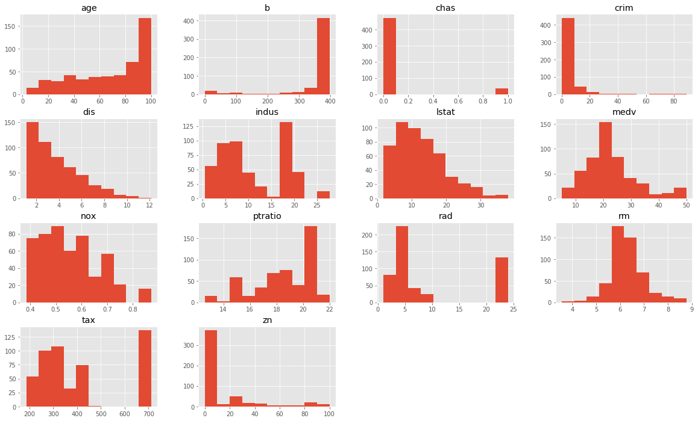

# Linear Regression on Boston Housing Data

Import data and all necessary libraries


```python
import pandas as pd 
import matplotlib.pyplot as plt
plt.style.use('ggplot')
boston = pd.read_csv('BostonHousing.csv')
```


```python
boston.head()
```


<div>
<style scoped>
    .dataframe tbody tr th:only-of-type {
        vertical-align: middle;
    }

    .dataframe tbody tr th {
        vertical-align: top;
    }

    .dataframe thead th {
        text-align: right;
    }
</style>
<table border="1" class="dataframe">
  <thead>
    <tr style="text-align: right;">
      <th></th>
      <th>crim</th>
      <th>zn</th>
      <th>indus</th>
      <th>chas</th>
      <th>nox</th>
      <th>rm</th>
      <th>age</th>
      <th>dis</th>
      <th>rad</th>
      <th>tax</th>
      <th>ptratio</th>
      <th>b</th>
      <th>lstat</th>
      <th>medv</th>
    </tr>
  </thead>
  <tbody>
    <tr>
      <td>0</td>
      <td>0.00632</td>
      <td>18.0</td>
      <td>2.31</td>
      <td>0</td>
      <td>0.538</td>
      <td>6.575</td>
      <td>65.2</td>
      <td>4.0900</td>
      <td>1</td>
      <td>296</td>
      <td>15.3</td>
      <td>396.90</td>
      <td>4.98</td>
      <td>24.0</td>
    </tr>
    <tr>
      <td>1</td>
      <td>0.02731</td>
      <td>0.0</td>
      <td>7.07</td>
      <td>0</td>
      <td>0.469</td>
      <td>6.421</td>
      <td>78.9</td>
      <td>4.9671</td>
      <td>2</td>
      <td>242</td>
      <td>17.8</td>
      <td>396.90</td>
      <td>9.14</td>
      <td>21.6</td>
    </tr>
    <tr>
      <td>2</td>
      <td>0.02729</td>
      <td>0.0</td>
      <td>7.07</td>
      <td>0</td>
      <td>0.469</td>
      <td>7.185</td>
      <td>61.1</td>
      <td>4.9671</td>
      <td>2</td>
      <td>242</td>
      <td>17.8</td>
      <td>392.83</td>
      <td>4.03</td>
      <td>34.7</td>
    </tr>
    <tr>
      <td>3</td>
      <td>0.03237</td>
      <td>0.0</td>
      <td>2.18</td>
      <td>0</td>
      <td>0.458</td>
      <td>6.998</td>
      <td>45.8</td>
      <td>6.0622</td>
      <td>3</td>
      <td>222</td>
      <td>18.7</td>
      <td>394.63</td>
      <td>2.94</td>
      <td>33.4</td>
    </tr>
    <tr>
      <td>4</td>
      <td>0.06905</td>
      <td>0.0</td>
      <td>2.18</td>
      <td>0</td>
      <td>0.458</td>
      <td>7.147</td>
      <td>54.2</td>
      <td>6.0622</td>
      <td>3</td>
      <td>222</td>
      <td>18.7</td>
      <td>396.90</td>
      <td>5.33</td>
      <td>36.2</td>
    </tr>
  </tbody>
</table>
</div>


```python
boston.dtypes
```


    crim       float64
    zn         float64
    indus      float64
    chas         int64
    nox        float64
    rm         float64
    age        float64
    dis        float64
    rad          int64
    tax          int64
    ptratio    float64
    b          float64
    lstat      float64
    medv       float64
    dtype: object


```python
boston.isna().sum()
```


    crim       0
    zn         0
    indus      0
    chas       0
    nox        0
    rm         0
    age        0
    dis        0
    rad        0
    tax        0
    ptratio    0
    b          0
    lstat      0
    medv       0
    dtype: int64


```python
print(boston['chas'].value_counts())
print(boston['rad'].value_counts())
print(boston['tax'].value_counts())
```

    0    471
    1     35
    Name: chas, dtype: int64
    24    132
    5     115
    4     110
    3      38
    6      26
    8      24
    2      24
    1      20
    7      17
    Name: rad, dtype: int64
    666    132
    307     40
    403     30
    437     15
    304     14
          ... 
    280      1
    313      1
    351      1
    422      1
    285      1
    Name: tax, Length: 66, dtype: int64


It appears that this dataset mostly contains continuous variables. Looking at the data types and observing the three integer columns, it looks like the variables `chas`, `rad`, and `tax` could possibly be categorical. This will be investigated further and confirmed to be true or untrue. Fortunately, there are also no missing or null values in this data.


```python
boston.hist(figsize=(20,12) );
```





Based on the histograms, there is quite a bit of skewness and kurtosis in these variables, particularly in variables such as `dis` and `age`. Some variables definitely have evidence of outliers, such as `rad` and `tax`. The target variable, `medv`, looks pretty normally distributed, although it looks like it has some outliers as well that will need to be taken care of.


```python

```
