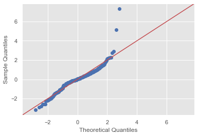

# Linear Regression on Boston Housing Data

Import data and all necessary libraries


```python
import pandas as pd 
import matplotlib.pyplot as plt
import numpy as np
plt.style.use('ggplot')
boston = pd.read_csv('BostonHousing.csv')
```


```python
boston.head()
```


<div>
<style scoped>
    .dataframe tbody tr th:only-of-type {
        vertical-align: middle;
    }

    .dataframe tbody tr th {
        vertical-align: top;
    }

    .dataframe thead th {
        text-align: right;
    }
</style>
<table border="1" class="dataframe">
  <thead>
    <tr style="text-align: right;">
      <th></th>
      <th>crim</th>
      <th>zn</th>
      <th>indus</th>
      <th>chas</th>
      <th>nox</th>
      <th>rm</th>
      <th>age</th>
      <th>dis</th>
      <th>rad</th>
      <th>tax</th>
      <th>ptratio</th>
      <th>b</th>
      <th>lstat</th>
      <th>medv</th>
    </tr>
  </thead>
  <tbody>
    <tr>
      <td>0</td>
      <td>0.00632</td>
      <td>18.0</td>
      <td>2.31</td>
      <td>0</td>
      <td>0.538</td>
      <td>6.575</td>
      <td>65.2</td>
      <td>4.0900</td>
      <td>1</td>
      <td>296</td>
      <td>15.3</td>
      <td>396.90</td>
      <td>4.98</td>
      <td>24.0</td>
    </tr>
    <tr>
      <td>1</td>
      <td>0.02731</td>
      <td>0.0</td>
      <td>7.07</td>
      <td>0</td>
      <td>0.469</td>
      <td>6.421</td>
      <td>78.9</td>
      <td>4.9671</td>
      <td>2</td>
      <td>242</td>
      <td>17.8</td>
      <td>396.90</td>
      <td>9.14</td>
      <td>21.6</td>
    </tr>
    <tr>
      <td>2</td>
      <td>0.02729</td>
      <td>0.0</td>
      <td>7.07</td>
      <td>0</td>
      <td>0.469</td>
      <td>7.185</td>
      <td>61.1</td>
      <td>4.9671</td>
      <td>2</td>
      <td>242</td>
      <td>17.8</td>
      <td>392.83</td>
      <td>4.03</td>
      <td>34.7</td>
    </tr>
    <tr>
      <td>3</td>
      <td>0.03237</td>
      <td>0.0</td>
      <td>2.18</td>
      <td>0</td>
      <td>0.458</td>
      <td>6.998</td>
      <td>45.8</td>
      <td>6.0622</td>
      <td>3</td>
      <td>222</td>
      <td>18.7</td>
      <td>394.63</td>
      <td>2.94</td>
      <td>33.4</td>
    </tr>
    <tr>
      <td>4</td>
      <td>0.06905</td>
      <td>0.0</td>
      <td>2.18</td>
      <td>0</td>
      <td>0.458</td>
      <td>7.147</td>
      <td>54.2</td>
      <td>6.0622</td>
      <td>3</td>
      <td>222</td>
      <td>18.7</td>
      <td>396.90</td>
      <td>5.33</td>
      <td>36.2</td>
    </tr>
  </tbody>
</table>
</div>


```python
boston.info()
```

    <class 'pandas.core.frame.DataFrame'>
    RangeIndex: 506 entries, 0 to 505
    Data columns (total 14 columns):
    crim       506 non-null float64
    zn         506 non-null float64
    indus      506 non-null float64
    chas       506 non-null int64
    nox        506 non-null float64
    rm         506 non-null float64
    age        506 non-null float64
    dis        506 non-null float64
    rad        506 non-null int64
    tax        506 non-null int64
    ptratio    506 non-null float64
    b          506 non-null float64
    lstat      506 non-null float64
    medv       506 non-null float64
    dtypes: float64(11), int64(3)
    memory usage: 55.5 KB


```python
boston.isna().sum()
```


    crim       0
    zn         0
    indus      0
    chas       0
    nox        0
    rm         0
    age        0
    dis        0
    rad        0
    tax        0
    ptratio    0
    b          0
    lstat      0
    medv       0
    dtype: int64


In order to check for the assumption of linearity, I created a new dataframe with all of the data except for the target variable, `medv`, which was dropped so that we can comapre the linearity of each column to it.


```python
data = boston.drop('medv', axis=1)
data.head()
```


<div>
<style scoped>
    .dataframe tbody tr th:only-of-type {
        vertical-align: middle;
    }

    .dataframe tbody tr th {
        vertical-align: top;
    }

    .dataframe thead th {
        text-align: right;
    }
</style>
<table border="1" class="dataframe">
  <thead>
    <tr style="text-align: right;">
      <th></th>
      <th>crim</th>
      <th>zn</th>
      <th>indus</th>
      <th>chas</th>
      <th>nox</th>
      <th>rm</th>
      <th>age</th>
      <th>dis</th>
      <th>rad</th>
      <th>tax</th>
      <th>ptratio</th>
      <th>b</th>
      <th>lstat</th>
    </tr>
  </thead>
  <tbody>
    <tr>
      <td>0</td>
      <td>0.00632</td>
      <td>18.0</td>
      <td>2.31</td>
      <td>0</td>
      <td>0.538</td>
      <td>6.575</td>
      <td>65.2</td>
      <td>4.0900</td>
      <td>1</td>
      <td>296</td>
      <td>15.3</td>
      <td>396.90</td>
      <td>4.98</td>
    </tr>
    <tr>
      <td>1</td>
      <td>0.02731</td>
      <td>0.0</td>
      <td>7.07</td>
      <td>0</td>
      <td>0.469</td>
      <td>6.421</td>
      <td>78.9</td>
      <td>4.9671</td>
      <td>2</td>
      <td>242</td>
      <td>17.8</td>
      <td>396.90</td>
      <td>9.14</td>
    </tr>
    <tr>
      <td>2</td>
      <td>0.02729</td>
      <td>0.0</td>
      <td>7.07</td>
      <td>0</td>
      <td>0.469</td>
      <td>7.185</td>
      <td>61.1</td>
      <td>4.9671</td>
      <td>2</td>
      <td>242</td>
      <td>17.8</td>
      <td>392.83</td>
      <td>4.03</td>
    </tr>
    <tr>
      <td>3</td>
      <td>0.03237</td>
      <td>0.0</td>
      <td>2.18</td>
      <td>0</td>
      <td>0.458</td>
      <td>6.998</td>
      <td>45.8</td>
      <td>6.0622</td>
      <td>3</td>
      <td>222</td>
      <td>18.7</td>
      <td>394.63</td>
      <td>2.94</td>
    </tr>
    <tr>
      <td>4</td>
      <td>0.06905</td>
      <td>0.0</td>
      <td>2.18</td>
      <td>0</td>
      <td>0.458</td>
      <td>7.147</td>
      <td>54.2</td>
      <td>6.0622</td>
      <td>3</td>
      <td>222</td>
      <td>18.7</td>
      <td>396.90</td>
      <td>5.33</td>
    </tr>
  </tbody>
</table>
</div>


```python
def linearity_check(df, target):
    for column in df:
        plt.scatter(df[column], target, label=column)
        plt.xlabel(column)
        plt.ylabel('Median Value')
        plt.title ('Linearity Assumption Check')
        plt.legend()
        plt.show()
```


```python
linearity_check(data, boston.medv)
```


Next, I am going to create histograms for each variable to make an initial normality analysis


```python
def normality_check(df):
    df.hist(figsize=(20,12) );
```


```python
normality_check(boston)
```


Based on the histograms, there is quite a bit of skewness and kurtosis in these variables, particularly in variables such as `dis` and `age`. Most variables definitely have evidence of outliers, such as `rad` and `tax`.

Below is a summary of my initial findings reagrding the linearity and normality assumptions for each variable *before* removing outliers:

* `crim` - No linearity, outliers are noticeable, continuous variable
* `zn` - No linearity, can't determine outliers from visual, categorical variable
* `indus` - No linearity, appears to have outliers, categorical variable
* `chas` - No linearity, maybe a couple outliers, categorical variable
* `nox` - No linearity, outliers present, from visual looks categorical, however need to look at column description
* `rm` - Linearity present, outliers apparent, continuous variable
* `age` - No linearity, outliers everywhere, ' continuous variable
* `dis` - Perhaps slight linearity, outliers present, continuous variable
* `rad` - No linearity, a few outliers, categorical variable
* `tax` - No linearity, outliers present, categorical variable
* `ptratio` - No linearity, outliers present, categorical variable
* `b` - No linearity, outliers present, continuous variable
* `lstat` - Linearity present, few outliers, continuous variable

Next, I will remove outliers so that I can observe any changes in linearity or normality.


```python
def find_outliers(col):
    from scipy import stats
    z = np.abs(stats.zscore(col))
    idx_outliers = np.where(z>3,True,False)
    return pd.Series(idx_outliers,index=col.index)
```


```python
df_clean = pd.DataFrame()
for col in boston.columns:
    idx = find_outliers(boston[col])
    df_clean[col] = idx
```


```python
idx_outliers = df_clean.any(axis=1)
df_clean_final = boston[idx_outliers==False]
df_clean_final.head()
```


<div>
<style scoped>
    .dataframe tbody tr th:only-of-type {
        vertical-align: middle;
    }

    .dataframe tbody tr th {
        vertical-align: top;
    }

    .dataframe thead th {
        text-align: right;
    }
</style>
<table border="1" class="dataframe">
  <thead>
    <tr style="text-align: right;">
      <th></th>
      <th>crim</th>
      <th>zn</th>
      <th>indus</th>
      <th>chas</th>
      <th>nox</th>
      <th>rm</th>
      <th>age</th>
      <th>dis</th>
      <th>rad</th>
      <th>tax</th>
      <th>ptratio</th>
      <th>b</th>
      <th>lstat</th>
      <th>medv</th>
    </tr>
  </thead>
  <tbody>
    <tr>
      <td>0</td>
      <td>0.00632</td>
      <td>18.0</td>
      <td>2.31</td>
      <td>0</td>
      <td>0.538</td>
      <td>6.575</td>
      <td>65.2</td>
      <td>4.0900</td>
      <td>1</td>
      <td>296</td>
      <td>15.3</td>
      <td>396.90</td>
      <td>4.98</td>
      <td>24.0</td>
    </tr>
    <tr>
      <td>1</td>
      <td>0.02731</td>
      <td>0.0</td>
      <td>7.07</td>
      <td>0</td>
      <td>0.469</td>
      <td>6.421</td>
      <td>78.9</td>
      <td>4.9671</td>
      <td>2</td>
      <td>242</td>
      <td>17.8</td>
      <td>396.90</td>
      <td>9.14</td>
      <td>21.6</td>
    </tr>
    <tr>
      <td>2</td>
      <td>0.02729</td>
      <td>0.0</td>
      <td>7.07</td>
      <td>0</td>
      <td>0.469</td>
      <td>7.185</td>
      <td>61.1</td>
      <td>4.9671</td>
      <td>2</td>
      <td>242</td>
      <td>17.8</td>
      <td>392.83</td>
      <td>4.03</td>
      <td>34.7</td>
    </tr>
    <tr>
      <td>3</td>
      <td>0.03237</td>
      <td>0.0</td>
      <td>2.18</td>
      <td>0</td>
      <td>0.458</td>
      <td>6.998</td>
      <td>45.8</td>
      <td>6.0622</td>
      <td>3</td>
      <td>222</td>
      <td>18.7</td>
      <td>394.63</td>
      <td>2.94</td>
      <td>33.4</td>
    </tr>
    <tr>
      <td>4</td>
      <td>0.06905</td>
      <td>0.0</td>
      <td>2.18</td>
      <td>0</td>
      <td>0.458</td>
      <td>7.147</td>
      <td>54.2</td>
      <td>6.0622</td>
      <td>3</td>
      <td>222</td>
      <td>18.7</td>
      <td>396.90</td>
      <td>5.33</td>
      <td>36.2</td>
    </tr>
  </tbody>
</table>
</div>


```python
df_clean_final.info()
```

    <class 'pandas.core.frame.DataFrame'>
    Int64Index: 415 entries, 0 to 505
    Data columns (total 14 columns):
    crim       415 non-null float64
    zn         415 non-null float64
    indus      415 non-null float64
    chas       415 non-null int64
    nox        415 non-null float64
    rm         415 non-null float64
    age        415 non-null float64
    dis        415 non-null float64
    rad        415 non-null int64
    tax        415 non-null int64
    ptratio    415 non-null float64
    b          415 non-null float64
    lstat      415 non-null float64
    medv       415 non-null float64
    dtypes: float64(11), int64(3)
    memory usage: 48.6 KB


```python
linearity_check(df_clean_final, df_clean_final.medv)
```


```python
normality_check(df_clean_final)
```


```python
def heatmap(df):

    import seaborn as sns

    sns.set(style="white")

    # Compute the correlation matrix
    corr = df.corr()

    # Generate a mask for the upper triangle
    mask = np.zeros_like(corr, dtype=np.bool)
    mask[np.triu_indices_from(mask)] = True

    # Set up the matplotlib figure
    f, ax = plt.subplots(figsize=(22, 12))

    # Generate a custom diverging colormap
    cmap = sns.diverging_palette(220, 10, as_cmap=True)

    # Draw the heatmap with the mask and correct aspect ratio
    sns.heatmap(corr, mask=mask, cmap=cmap, center=0,
                square=True, linewidths=.5, cbar_kws={"shrink": .5}, annot=True)
```


```python
heatmap(df_clean_final)
```


No results appeared for `chas`, so it will be dropped.


```python
df_clean_final.drop(['chas'],axis=1,inplace=True)
df_clean_final.info()
```

    <class 'pandas.core.frame.DataFrame'>
    Int64Index: 415 entries, 0 to 505
    Data columns (total 13 columns):
    crim       415 non-null float64
    zn         415 non-null float64
    indus      415 non-null float64
    nox        415 non-null float64
    rm         415 non-null float64
    age        415 non-null float64
    dis        415 non-null float64
    rad        415 non-null int64
    tax        415 non-null int64
    ptratio    415 non-null float64
    b          415 non-null float64
    lstat      415 non-null float64
    medv       415 non-null float64
    dtypes: float64(11), int64(2)
    memory usage: 45.4 KB


    /Users/acusiobivona/opt/anaconda3/lib/python3.7/site-packages/pandas/core/frame.py:4102: SettingWithCopyWarning: 
    A value is trying to be set on a copy of a slice from a DataFrame
    
    See the caveats in the documentation: http://pandas.pydata.org/pandas-docs/stable/user_guide/indexing.html#returning-a-view-versus-a-copy
      errors=errors,


There is a multicollinearity issue between `rad`, `crim` and `tax`, so I am going to drop `rad` and recreate the heatmap. This should resolve the issue between all three.


```python
df_clean_final.drop(['rad'],axis=1,inplace=True)
df_clean_final.info()
```

    <class 'pandas.core.frame.DataFrame'>
    Int64Index: 415 entries, 0 to 505
    Data columns (total 12 columns):
    crim       415 non-null float64
    zn         415 non-null float64
    indus      415 non-null float64
    nox        415 non-null float64
    rm         415 non-null float64
    age        415 non-null float64
    dis        415 non-null float64
    tax        415 non-null int64
    ptratio    415 non-null float64
    b          415 non-null float64
    lstat      415 non-null float64
    medv       415 non-null float64
    dtypes: float64(11), int64(1)
    memory usage: 42.1 KB


```python
heatmap(df_clean_final)
```


The major multicollinearity issues have been resolved. There a couple of mildly high scores, such as 0.73, but I'm going to go forward with things as they stand so that there are more variables to explore. If results are not very good, then I wll explore potentially removing a/some variable(s).

## Feature Selection

To begin, I am going to start by observing the 2 highest scored variables with the target variable, `medv`: `rm` and `zn`. This will be just a beginning analysis because `dis` and `b` have a tied score. If results on these first two variables are poor, then I will explore the latter two to see what we get. 


```python
def scatter_plot(df, x, y):
    df.plot(x, y, kind='scatter')
```


```python
scatter_plot(df_clean_final, 'medv', 'rm')
scatter_plot(df_clean_final, 'medv', 'zn')
```

    'c' argument looks like a single numeric RGB or RGBA sequence, which should be avoided as value-mapping will have precedence in case its length matches with 'x' & 'y'.  Please use a 2-D array with a single row if you really want to specify the same RGB or RGBA value for all points.
    'c' argument looks like a single numeric RGB or RGBA sequence, which should be avoided as value-mapping will have precedence in case its length matches with 'x' & 'y'.  Please use a 2-D array with a single row if you really want to specify the same RGB or RGBA value for all points.


There appears to be a linear relationship between `medv` and `rm`, but not `medv` and `zn`. Because of this, the legitimacy of `zn` as a variable must be questioned because it doesn't pass the linearity assumption. For now, I'm going to go through the entire regression process with these variables as is, just as a vanilla process.


```python
%matplotlib inline
import statsmodels.api as sm
import statsmodels.stats.api as sms
import statsmodels.formula.api as smf
import scipy.stats as stats
plt.style.use('ggplot')

f = 'medv~rm'
f2 = 'medv~zn'

model = smf.ols(formula=f, data=df_clean_final).fit()
model2 = smf.ols(formula=f2, data=df_clean_final).fit()

resid1 = model.resid
resid2 = model2.resid

display(model.summary())

fig = sm.graphics.qqplot(resid1, dist=stats.norm, line='45', fit=True)
plt.show()

display(model2.summary())

fig2 = sm.graphics.qqplot(resid2, dist=stats.norm, line='45', fit=True)
plt.show()
```


<table class="simpletable">
<caption>OLS Regression Results</caption>
<tr>
  <th>Dep. Variable:</th>          <td>medv</td>       <th>  R-squared:         </th> <td>   0.539</td>
</tr>
<tr>
  <th>Model:</th>                   <td>OLS</td>       <th>  Adj. R-squared:    </th> <td>   0.538</td>
</tr>
<tr>
  <th>Method:</th>             <td>Least Squares</td>  <th>  F-statistic:       </th> <td>   482.5</td>
</tr>
<tr>
  <th>Date:</th>             <td>Sat, 09 Jan 2021</td> <th>  Prob (F-statistic):</th> <td>2.08e-71</td>
</tr>
<tr>
  <th>Time:</th>                 <td>14:48:05</td>     <th>  Log-Likelihood:    </th> <td> -1294.7</td>
</tr>
<tr>
  <th>No. Observations:</th>      <td>   415</td>      <th>  AIC:               </th> <td>   2593.</td>
</tr>
<tr>
  <th>Df Residuals:</th>          <td>   413</td>      <th>  BIC:               </th> <td>   2602.</td>
</tr>
<tr>
  <th>Df Model:</th>              <td>     1</td>      <th>                     </th>     <td> </td>   
</tr>
<tr>
  <th>Covariance Type:</th>      <td>nonrobust</td>    <th>                     </th>     <td> </td>   
</tr>
</table>
<table class="simpletable">
<tr>
      <td></td>         <th>coef</th>     <th>std err</th>      <th>t</th>      <th>P>|t|</th>  <th>[0.025</th>    <th>0.975]</th>  
</tr>
<tr>
  <th>Intercept</th> <td>  -38.4062</td> <td>    2.779</td> <td>  -13.819</td> <td> 0.000</td> <td>  -43.869</td> <td>  -32.943</td>
</tr>
<tr>
  <th>rm</th>        <td>    9.6944</td> <td>    0.441</td> <td>   21.966</td> <td> 0.000</td> <td>    8.827</td> <td>   10.562</td>
</tr>
</table>
<table class="simpletable">
<tr>
  <th>Omnibus:</th>       <td>124.274</td> <th>  Durbin-Watson:     </th> <td>   0.832</td> 
</tr>
<tr>
  <th>Prob(Omnibus):</th> <td> 0.000</td>  <th>  Jarque-Bera (JB):  </th> <td>1299.795</td> 
</tr>
<tr>
  <th>Skew:</th>          <td> 0.949</td>  <th>  Prob(JB):          </th> <td>5.66e-283</td>
</tr>
<tr>
  <th>Kurtosis:</th>      <td>11.460</td>  <th>  Cond. No.          </th> <td>    66.5</td> 
</tr>
</table><br/><br/>Warnings:<br/>[1] Standard Errors assume that the covariance matrix of the errors is correctly specified.





<table class="simpletable">
<caption>OLS Regression Results</caption>
<tr>
  <th>Dep. Variable:</th>          <td>medv</td>       <th>  R-squared:         </th> <td>   0.094</td>
</tr>
<tr>
  <th>Model:</th>                   <td>OLS</td>       <th>  Adj. R-squared:    </th> <td>   0.092</td>
</tr>
<tr>
  <th>Method:</th>             <td>Least Squares</td>  <th>  F-statistic:       </th> <td>   42.72</td>
</tr>
<tr>
  <th>Date:</th>             <td>Sat, 09 Jan 2021</td> <th>  Prob (F-statistic):</th> <td>1.87e-10</td>
</tr>
<tr>
  <th>Time:</th>                 <td>14:48:06</td>     <th>  Log-Likelihood:    </th> <td> -1434.9</td>
</tr>
<tr>
  <th>No. Observations:</th>      <td>   415</td>      <th>  AIC:               </th> <td>   2874.</td>
</tr>
<tr>
  <th>Df Residuals:</th>          <td>   413</td>      <th>  BIC:               </th> <td>   2882.</td>
</tr>
<tr>
  <th>Df Model:</th>              <td>     1</td>      <th>                     </th>     <td> </td>   
</tr>
<tr>
  <th>Covariance Type:</th>      <td>nonrobust</td>    <th>                     </th>     <td> </td>   
</tr>
</table>
<table class="simpletable">
<tr>
      <td></td>         <th>coef</th>     <th>std err</th>      <th>t</th>      <th>P>|t|</th>  <th>[0.025</th>    <th>0.975]</th>  
</tr>
<tr>
  <th>Intercept</th> <td>   21.1471</td> <td>    0.421</td> <td>   50.277</td> <td> 0.000</td> <td>   20.320</td> <td>   21.974</td>
</tr>
<tr>
  <th>zn</th>        <td>    0.1257</td> <td>    0.019</td> <td>    6.536</td> <td> 0.000</td> <td>    0.088</td> <td>    0.163</td>
</tr>
</table>
<table class="simpletable">
<tr>
  <th>Omnibus:</th>       <td>108.505</td> <th>  Durbin-Watson:     </th> <td>   0.836</td>
</tr>
<tr>
  <th>Prob(Omnibus):</th> <td> 0.000</td>  <th>  Jarque-Bera (JB):  </th> <td> 251.650</td>
</tr>
<tr>
  <th>Skew:</th>          <td> 1.321</td>  <th>  Prob(JB):          </th> <td>2.26e-55</td>
</tr>
<tr>
  <th>Kurtosis:</th>      <td> 5.752</td>  <th>  Cond. No.          </th> <td>    24.4</td>
</tr>
</table><br/><br/>Warnings:<br/>[1] Standard Errors assume that the covariance matrix of the errors is correctly specified.


```python
from statsmodels.formula.api import ols
f = 'medv~rm+zn'
model = ols(formula=f, data=df_clean_final).fit()
model.summary()
```


<table class="simpletable">
<caption>OLS Regression Results</caption>
<tr>
  <th>Dep. Variable:</th>          <td>medv</td>       <th>  R-squared:         </th> <td>   0.549</td>
</tr>
<tr>
  <th>Model:</th>                   <td>OLS</td>       <th>  Adj. R-squared:    </th> <td>   0.547</td>
</tr>
<tr>
  <th>Method:</th>             <td>Least Squares</td>  <th>  F-statistic:       </th> <td>   250.8</td>
</tr>
<tr>
  <th>Date:</th>             <td>Sat, 09 Jan 2021</td> <th>  Prob (F-statistic):</th> <td>5.76e-72</td>
</tr>
<tr>
  <th>Time:</th>                 <td>14:48:06</td>     <th>  Log-Likelihood:    </th> <td> -1290.1</td>
</tr>
<tr>
  <th>No. Observations:</th>      <td>   415</td>      <th>  AIC:               </th> <td>   2586.</td>
</tr>
<tr>
  <th>Df Residuals:</th>          <td>   412</td>      <th>  BIC:               </th> <td>   2598.</td>
</tr>
<tr>
  <th>Df Model:</th>              <td>     2</td>      <th>                     </th>     <td> </td>   
</tr>
<tr>
  <th>Covariance Type:</th>      <td>nonrobust</td>    <th>                     </th>     <td> </td>   
</tr>
</table>
<table class="simpletable">
<tr>
      <td></td>         <th>coef</th>     <th>std err</th>      <th>t</th>      <th>P>|t|</th>  <th>[0.025</th>    <th>0.975]</th>  
</tr>
<tr>
  <th>Intercept</th> <td>  -36.3343</td> <td>    2.834</td> <td>  -12.820</td> <td> 0.000</td> <td>  -41.906</td> <td>  -30.763</td>
</tr>
<tr>
  <th>rm</th>        <td>    9.2976</td> <td>    0.456</td> <td>   20.393</td> <td> 0.000</td> <td>    8.401</td> <td>   10.194</td>
</tr>
<tr>
  <th>zn</th>        <td>    0.0432</td> <td>    0.014</td> <td>    3.050</td> <td> 0.002</td> <td>    0.015</td> <td>    0.071</td>
</tr>
</table>
<table class="simpletable">
<tr>
  <th>Omnibus:</th>       <td>139.817</td> <th>  Durbin-Watson:     </th> <td>   0.849</td>
</tr>
<tr>
  <th>Prob(Omnibus):</th> <td> 0.000</td>  <th>  Jarque-Bera (JB):  </th> <td>1438.941</td>
</tr>
<tr>
  <th>Skew:</th>          <td> 1.120</td>  <th>  Prob(JB):          </th> <td>    0.00</td>
</tr>
<tr>
  <th>Kurtosis:</th>      <td>11.843</td>  <th>  Cond. No.          </th> <td>    237.</td>
</tr>
</table><br/><br/>Warnings:<br/>[1] Standard Errors assume that the covariance matrix of the errors is correctly specified.


### Initial Conclusion

Looking at the r-squared score, only 54.9% of the results can be directly explained by the data. This suggest 1 of 2 things, or possibly both:

* There isn't enough total data samples (only 415 observations)
* The data needs to be more thoroughly preprocessed before running the model.

So, I am going to go through the variables and scale them to try and imporve performance. All variables will be scaled, excpet for the target variable `medv`.


```python
import seaborn as sns
x = df_clean_final['medv']
ax = sns.distplot(x)
```


```python
from sklearn.preprocessing import StandardScaler
def scale(df, col):
    scaler = StandardScaler()
    col_data = df[col].values.reshape(-1,1)
    scale_data = scaler.fit_transform(col_data)
    df[col] = scale_data.flatten()

    z = df[col]
    ax = sns.distplot(z)
```


```python
scale(df_clean_final, 'crim')
```

    /Users/acusiobivona/opt/anaconda3/lib/python3.7/site-packages/ipykernel_launcher.py:6: SettingWithCopyWarning: 
    A value is trying to be set on a copy of a slice from a DataFrame.
    Try using .loc[row_indexer,col_indexer] = value instead
    
    See the caveats in the documentation: http://pandas.pydata.org/pandas-docs/stable/user_guide/indexing.html#returning-a-view-versus-a-copy
      


```python
scale(df_clean_final, 'zn')
```

    /Users/acusiobivona/opt/anaconda3/lib/python3.7/site-packages/ipykernel_launcher.py:6: SettingWithCopyWarning: 
    A value is trying to be set on a copy of a slice from a DataFrame.
    Try using .loc[row_indexer,col_indexer] = value instead
    
    See the caveats in the documentation: http://pandas.pydata.org/pandas-docs/stable/user_guide/indexing.html#returning-a-view-versus-a-copy
      


```python
scale(df_clean_final, 'indus')
```

    /Users/acusiobivona/opt/anaconda3/lib/python3.7/site-packages/ipykernel_launcher.py:6: SettingWithCopyWarning: 
    A value is trying to be set on a copy of a slice from a DataFrame.
    Try using .loc[row_indexer,col_indexer] = value instead
    
    See the caveats in the documentation: http://pandas.pydata.org/pandas-docs/stable/user_guide/indexing.html#returning-a-view-versus-a-copy
      


```python
scale(df_clean_final, 'nox')
```

    /Users/acusiobivona/opt/anaconda3/lib/python3.7/site-packages/ipykernel_launcher.py:6: SettingWithCopyWarning: 
    A value is trying to be set on a copy of a slice from a DataFrame.
    Try using .loc[row_indexer,col_indexer] = value instead
    
    See the caveats in the documentation: http://pandas.pydata.org/pandas-docs/stable/user_guide/indexing.html#returning-a-view-versus-a-copy
      


```python
scale(df_clean_final, 'rm')
```

    /Users/acusiobivona/opt/anaconda3/lib/python3.7/site-packages/ipykernel_launcher.py:6: SettingWithCopyWarning: 
    A value is trying to be set on a copy of a slice from a DataFrame.
    Try using .loc[row_indexer,col_indexer] = value instead
    
    See the caveats in the documentation: http://pandas.pydata.org/pandas-docs/stable/user_guide/indexing.html#returning-a-view-versus-a-copy
      


```python
scale(df_clean_final, 'age')
```

    /Users/acusiobivona/opt/anaconda3/lib/python3.7/site-packages/ipykernel_launcher.py:6: SettingWithCopyWarning: 
    A value is trying to be set on a copy of a slice from a DataFrame.
    Try using .loc[row_indexer,col_indexer] = value instead
    
    See the caveats in the documentation: http://pandas.pydata.org/pandas-docs/stable/user_guide/indexing.html#returning-a-view-versus-a-copy
      


```python
scale(df_clean_final, 'dis')
```

    /Users/acusiobivona/opt/anaconda3/lib/python3.7/site-packages/ipykernel_launcher.py:6: SettingWithCopyWarning: 
    A value is trying to be set on a copy of a slice from a DataFrame.
    Try using .loc[row_indexer,col_indexer] = value instead
    
    See the caveats in the documentation: http://pandas.pydata.org/pandas-docs/stable/user_guide/indexing.html#returning-a-view-versus-a-copy
      


```python
scale(df_clean_final, 'tax')
```

    /Users/acusiobivona/opt/anaconda3/lib/python3.7/site-packages/ipykernel_launcher.py:6: SettingWithCopyWarning: 
    A value is trying to be set on a copy of a slice from a DataFrame.
    Try using .loc[row_indexer,col_indexer] = value instead
    
    See the caveats in the documentation: http://pandas.pydata.org/pandas-docs/stable/user_guide/indexing.html#returning-a-view-versus-a-copy
      


```python
scale(df_clean_final, 'ptratio')
```

    /Users/acusiobivona/opt/anaconda3/lib/python3.7/site-packages/ipykernel_launcher.py:6: SettingWithCopyWarning: 
    A value is trying to be set on a copy of a slice from a DataFrame.
    Try using .loc[row_indexer,col_indexer] = value instead
    
    See the caveats in the documentation: http://pandas.pydata.org/pandas-docs/stable/user_guide/indexing.html#returning-a-view-versus-a-copy
      


```python
scale(df_clean_final, 'b')
```

    /Users/acusiobivona/opt/anaconda3/lib/python3.7/site-packages/ipykernel_launcher.py:6: SettingWithCopyWarning: 
    A value is trying to be set on a copy of a slice from a DataFrame.
    Try using .loc[row_indexer,col_indexer] = value instead
    
    See the caveats in the documentation: http://pandas.pydata.org/pandas-docs/stable/user_guide/indexing.html#returning-a-view-versus-a-copy
      


```python
scale(df_clean_final, 'lstat')
```

    /Users/acusiobivona/opt/anaconda3/lib/python3.7/site-packages/ipykernel_launcher.py:6: SettingWithCopyWarning: 
    A value is trying to be set on a copy of a slice from a DataFrame.
    Try using .loc[row_indexer,col_indexer] = value instead
    
    See the caveats in the documentation: http://pandas.pydata.org/pandas-docs/stable/user_guide/indexing.html#returning-a-view-versus-a-copy
      


```python
scaled_df = df_clean_final.copy()
scaled_df.info()
```

    <class 'pandas.core.frame.DataFrame'>
    Int64Index: 415 entries, 0 to 505
    Data columns (total 12 columns):
    crim       415 non-null float64
    zn         415 non-null float64
    indus      415 non-null float64
    nox        415 non-null float64
    rm         415 non-null float64
    age        415 non-null float64
    dis        415 non-null float64
    tax        415 non-null float64
    ptratio    415 non-null float64
    b          415 non-null float64
    lstat      415 non-null float64
    medv       415 non-null float64
    dtypes: float64(12)
    memory usage: 42.1 KB


```python
heatmap(scaled_df)
```


```python
scatter_plot(scaled_df, 'medv', 'rm')
scatter_plot(scaled_df, 'medv', 'zn')
```

    'c' argument looks like a single numeric RGB or RGBA sequence, which should be avoided as value-mapping will have precedence in case its length matches with 'x' & 'y'.  Please use a 2-D array with a single row if you really want to specify the same RGB or RGBA value for all points.
    'c' argument looks like a single numeric RGB or RGBA sequence, which should be avoided as value-mapping will have precedence in case its length matches with 'x' & 'y'.  Please use a 2-D array with a single row if you really want to specify the same RGB or RGBA value for all points.


```python
f = 'medv~rm'
f2 = 'medv~zn'

model = smf.ols(formula=f, data=scaled_df).fit()
model2 = smf.ols(formula=f2, data=scaled_df).fit()

resid1 = model.resid
resid2 = model2.resid

display(model.summary())
fig = sm.graphics.qqplot(resid1, dist=stats.norm, line='45', fit=True)
plt.show()
display(model2.summary())
fig2 = sm.graphics.qqplot(resid2, dist=stats.norm, line='45', fit=True)
plt.show()
```


<table class="simpletable">
<caption>OLS Regression Results</caption>
<tr>
  <th>Dep. Variable:</th>          <td>medv</td>       <th>  R-squared:         </th> <td>   0.539</td>
</tr>
<tr>
  <th>Model:</th>                   <td>OLS</td>       <th>  Adj. R-squared:    </th> <td>   0.538</td>
</tr>
<tr>
  <th>Method:</th>             <td>Least Squares</td>  <th>  F-statistic:       </th> <td>   482.5</td>
</tr>
<tr>
  <th>Date:</th>             <td>Sat, 09 Jan 2021</td> <th>  Prob (F-statistic):</th> <td>2.08e-71</td>
</tr>
<tr>
  <th>Time:</th>                 <td>14:48:21</td>     <th>  Log-Likelihood:    </th> <td> -1294.7</td>
</tr>
<tr>
  <th>No. Observations:</th>      <td>   415</td>      <th>  AIC:               </th> <td>   2593.</td>
</tr>
<tr>
  <th>Df Residuals:</th>          <td>   413</td>      <th>  BIC:               </th> <td>   2602.</td>
</tr>
<tr>
  <th>Df Model:</th>              <td>     1</td>      <th>                     </th>     <td> </td>   
</tr>
<tr>
  <th>Covariance Type:</th>      <td>nonrobust</td>    <th>                     </th>     <td> </td>   
</tr>
</table>
<table class="simpletable">
<tr>
      <td></td>         <th>coef</th>     <th>std err</th>      <th>t</th>      <th>P>|t|</th>  <th>[0.025</th>    <th>0.975]</th>  
</tr>
<tr>
  <th>Intercept</th> <td>   22.3540</td> <td>    0.270</td> <td>   82.918</td> <td> 0.000</td> <td>   21.824</td> <td>   22.884</td>
</tr>
<tr>
  <th>rm</th>        <td>    5.9220</td> <td>    0.270</td> <td>   21.966</td> <td> 0.000</td> <td>    5.392</td> <td>    6.452</td>
</tr>
</table>
<table class="simpletable">
<tr>
  <th>Omnibus:</th>       <td>124.274</td> <th>  Durbin-Watson:     </th> <td>   0.832</td> 
</tr>
<tr>
  <th>Prob(Omnibus):</th> <td> 0.000</td>  <th>  Jarque-Bera (JB):  </th> <td>1299.795</td> 
</tr>
<tr>
  <th>Skew:</th>          <td> 0.949</td>  <th>  Prob(JB):          </th> <td>5.66e-283</td>
</tr>
<tr>
  <th>Kurtosis:</th>      <td>11.460</td>  <th>  Cond. No.          </th> <td>    1.00</td> 
</tr>
</table><br/><br/>Warnings:<br/>[1] Standard Errors assume that the covariance matrix of the errors is correctly specified.


<table class="simpletable">
<caption>OLS Regression Results</caption>
<tr>
  <th>Dep. Variable:</th>          <td>medv</td>       <th>  R-squared:         </th> <td>   0.094</td>
</tr>
<tr>
  <th>Model:</th>                   <td>OLS</td>       <th>  Adj. R-squared:    </th> <td>   0.092</td>
</tr>
<tr>
  <th>Method:</th>             <td>Least Squares</td>  <th>  F-statistic:       </th> <td>   42.72</td>
</tr>
<tr>
  <th>Date:</th>             <td>Sat, 09 Jan 2021</td> <th>  Prob (F-statistic):</th> <td>1.87e-10</td>
</tr>
<tr>
  <th>Time:</th>                 <td>14:48:21</td>     <th>  Log-Likelihood:    </th> <td> -1434.9</td>
</tr>
<tr>
  <th>No. Observations:</th>      <td>   415</td>      <th>  AIC:               </th> <td>   2874.</td>
</tr>
<tr>
  <th>Df Residuals:</th>          <td>   413</td>      <th>  BIC:               </th> <td>   2882.</td>
</tr>
<tr>
  <th>Df Model:</th>              <td>     1</td>      <th>                     </th>     <td> </td>   
</tr>
<tr>
  <th>Covariance Type:</th>      <td>nonrobust</td>    <th>                     </th>     <td> </td>   
</tr>
</table>
<table class="simpletable">
<tr>
      <td></td>         <th>coef</th>     <th>std err</th>      <th>t</th>      <th>P>|t|</th>  <th>[0.025</th>    <th>0.975]</th>  
</tr>
<tr>
  <th>Intercept</th> <td>   22.3540</td> <td>    0.378</td> <td>   59.150</td> <td> 0.000</td> <td>   21.611</td> <td>   23.097</td>
</tr>
<tr>
  <th>zn</th>        <td>    2.4701</td> <td>    0.378</td> <td>    6.536</td> <td> 0.000</td> <td>    1.727</td> <td>    3.213</td>
</tr>
</table>
<table class="simpletable">
<tr>
  <th>Omnibus:</th>       <td>108.505</td> <th>  Durbin-Watson:     </th> <td>   0.836</td>
</tr>
<tr>
  <th>Prob(Omnibus):</th> <td> 0.000</td>  <th>  Jarque-Bera (JB):  </th> <td> 251.650</td>
</tr>
<tr>
  <th>Skew:</th>          <td> 1.321</td>  <th>  Prob(JB):          </th> <td>2.26e-55</td>
</tr>
<tr>
  <th>Kurtosis:</th>      <td> 5.752</td>  <th>  Cond. No.          </th> <td>    1.00</td>
</tr>
</table><br/><br/>Warnings:<br/>[1] Standard Errors assume that the covariance matrix of the errors is correctly specified.


So, either scaling has made essentially no difference, or I have made a mistake and need to investigate more because the results of the heat map and qq plots are identical.


```python

```
